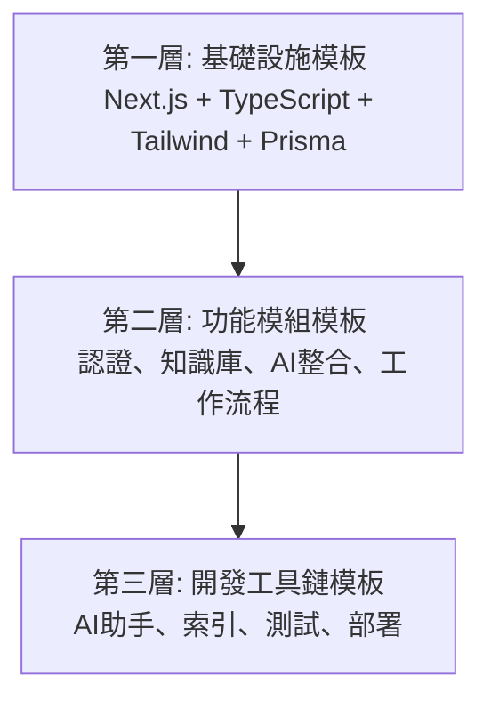

# 🚀 Web App 初始化模板系統 - 完整建議方案

## 1. 核心概念：三層模板架構

基於您的項目，我們將建立一個分層、可組合的模板系統，以實現最大的靈活性和重用性。



---

## 2. 🏗️ 第一層：基礎設施模板 (Infrastructure Base Template)

這是所有項目的起點，包含一個標準化的、生產就緒的 Next.js 14 全棧架構。

### 2.1 核心技術棧標準化

創建一個 `template-base/` 文件夾，包含所有基礎配置文件和結構。

- **`package.json.template`**: 標準化的依賴包，固定版本以確保穩定性。
- **`next.config.js.template`**: 優化過的 Next.js 配置。
- **`tsconfig.json.template`**: 啟用嚴格模式的 TypeScript 配置。
- **`tailwind.config.js.template`**: 基礎 Tailwind CSS 配置。
- **`prisma/schema.prisma.template`**: 包含 `User`, `Session`, `TokenBlacklist` 等基礎模型的 Prisma Schema。
- **`.env.template`**: 完整的環境變數範本，包含所有必要變數的說明。

### 2.2 項目結構標準化

提供一個清晰、可擴展的文件夾結構，作為所有未來項目的基礎。

```
/app
  /(auth)         # 認證頁面
  /(dashboard)    # 儀表板區域
  /api            # API 路由
/components
  /ui             # 基礎 UI 組件
  /layout         # 佈局組件
/lib
  /auth           # 認證邏輯
  /db             # 數據庫連接
/types            # TypeScript 類型
```

---

## 3. 🔧 第二層：功能模組模板 (Feature Module Templates)

將項目的核心功能抽象為可選安裝的獨立模組。

- **認證系統模組 (`module-auth/`)**: 包含登入/註冊組件、JWT/Session處理、API路由和數據模型。
- **知識庫模組 (`module-knowledge-base/`)**: 包含向量搜索、文件解析、內容管理組件和 API。
- **AI整合模組 (`module-ai-integration/`)**: 封裝 Azure OpenAI 客戶端、Prompt模板和 AI 回應快取。
- **工作流程引擎模組 (`module-workflow/`)**: 包含狀態機、版本控制、評論和審批系統的核心邏輯。
- **API Gateway模組 (`module-api-gateway/`)**: 包含速率限制、請求驗證、統一錯誤處理和路由管理的完整 API Gateway 架構。

每個模組都將包含一個 `install.sh` 腳本，用於自動將代碼、依賴和配置合併到主項目中。

---

## 4. 🛠️ 第三層：開發工具鏈模板 (DevOps Toolchain Templates)

這是您項目的獨特優勢，我們將其模板化以應用於所有未來項目。

- **文件管理系統 (`toolchain-docs/`)**:
  - `AI-ASSISTANT-GUIDE.md.template`
  - `PROJECT-INDEX.md.template`
  - `DEVELOPMENT-LOG.md.template`
  - `FIXLOG.md.template`
  - 自動化索引維護腳本 (`check-index-sync.js`)

- **測試框架模板 (`toolchain-testing/`)**:
  - Jest 和 Playwright 的標準配置。
  - 共享的測試工具和 mock 函數。
  - `run-integration-tests.ts` 等自動化測試腳本。

- **部署管道模板 (`toolchain-deployment/`)**:
  - `docker-compose.dev.yml.template` 和 `docker-compose.prod.yml.template`。
  - 生產級 `Dockerfile.template`。
  - `nginx.conf.template`。
  - `health-check.js` 健康檢查腳本。
  - `generate-deployment-guide.js` - 根據安裝的模組動態生成部署指南。

---

## 5. 🎯 完整實施方案

### 5.1 創建模板儲存庫

我們將在一個獨立的儲存庫中創建這個模板系統，其結構如下：

```
/webapp-template
  /00-base
  /01-modules
  /02-toolchain
  /scripts
    init-project.js
    install-module.js
  README.md
```

### 5.2 開發智能化安裝CLI

創建一個基於 `inquirer` 的互動式CLI工具 (`init-project.js`)，引導開發者：
1. 輸入新項目名稱。
2. 選擇需要的功能模組。
3. 選擇需要的開發工具鏈。

CLI 將自動從模板庫中複製文件、安裝依賴並配置項目。

### 5.3 建立配置變數替換系統

開發一個腳本，用於將模板文件（`.template`）中的佔位符（如 `{{PROJECT_NAME}}`）替換為用戶輸入或環境變數。

---

## 6. 📊 模板化優先級與實施計劃 (2週)

### 優先級

1.  **P0**: 開發工具鏈 (Toolchain) - 您的獨特優勢。
2.  **P0**: 基礎設施 (Base) - 所有項目的基礎。
3.  **P1**: 認證系統 (Auth) - 通用需求。
4.  **P1**: API Gateway (API Gateway) - 統一的 API 管理架構。
5.  **P1**: 知識庫 (Knowledge Base) - 已非常完整，易於提取。
6.  **P2**: AI整合 (AI Integration) - 常用模組。
7.  **P2**: 工作流程引擎 (Workflow) - 高級可選功能。

### 實施計劃

**Week 1: 核心模板建立**
- **Day 1-2**: 建立 `00-base` 基礎設施模板。
- **Day 3-4**: 提取並建立 `02-toolchain` 開發工具鏈模板。
- **Day 5**: 開發基礎的 `init-project.js` CLI 工具。

**Week 2: 功能模組抽取**
- **Day 6-7**: 提取並建立 `01-modules/auth` 認證系統模組。
- **Day 8**: 提取並建立 `01-modules/api-gateway` API Gateway 模組。
- **Day 9-10**: 提取並建立 `01-modules/knowledge-base` 知識庫模組。
- **Day 11-12**: 進行整合測試，使用模板創建一個新的測試項目並驗證流程。

---

## 7. 🚀 最終交付物

一個名為 `create-ai-webapp` 的 NPM 包或 Git 儲存庫，允許開發者通過一個簡單的命令快速啟動一個功能齊全、配置完善、包含您獨特開發流程的新項目。

```bash
npx create-ai-webapp my-new-project
# ... or ...
git clone https://github.com/laitim2001/ai-webapp-template.git && cd ai-webapp-template && node scripts/init-project.js
```

這個方案將您的成功經驗轉化為一個可重用的、標準化的啟動器，極大地加速未來項目的開發速度和品質。

