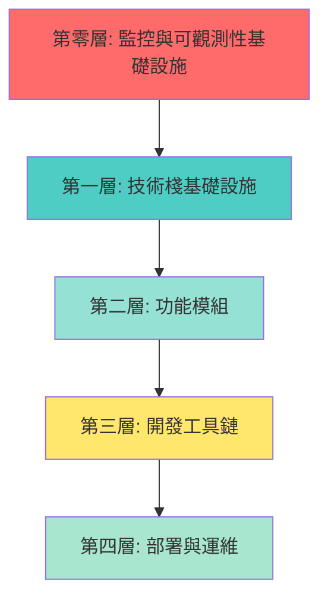

# 🎯 Web App 初始化模板 - 最終完整實施計劃 v3.0
# AI Web App Template - Final Implementation Plan

**版本**: 3.0 (包含監控系統和設計模式)  
**日期**: 2025-01-10  
**狀態**: ✅ 已深度分析項目，確保完整性  
**GitHub**: https://github.com/laitim2001/ai-webapp-template.git

---

## 🚨 關鍵發現：相比 v2.0 的重大補充

經過深度代碼庫分析，發現以下**關鍵組件必須納入模板**：

### 🆕 新發現 1：企業級監控系統
- **OpenTelemetry 完整堆疊**：Metrics + Traces + Logs
- **供應商中立設計**：Prometheus（開發）+ Azure Monitor（生產）
- **46 條告警規則**：P1-P4 四級別告警系統
- **完整 Docker 監控堆疊**：Prometheus + Grafana + Jaeger + Alertmanager

### 🆕 新發現 2：工作流程引擎設計模式
- **6 種核心設計模式**的生產級實現
- **狀態機系統**：30+ 種狀態轉換
- **完整的事務安全**和權限驗證

### 🆕 新發現 3：性能監控服務
- **智能性能監控**：8 種指標自動追蹤
- **連接健康監控**：5 服務自動檢查
- **自動重連**和狀態緩存管理

---

## 📊 模板架構總覽（完整版）



---

## 🏗️ 第零層：監控與可觀測性基礎設施 ⭐ 新增

> **這是你的項目的核心競爭力，必須優先模板化！**

### 0.1 OpenTelemetry 核心系統

#### 文件提取清單

**核心監控組件** (`monitoring-core/`):
```
monitoring-core/
├── instrumentation.ts.template              # Next.js 自動初始化（4.1 行）
├── lib/monitoring/
│   ├── telemetry.ts.template                # 統一遙測層（3,610 行）⭐
│   ├── config.ts.template                   # 多後端配置（176 行）
│   ├── backend-factory.ts.template          # 動態後端工廠（267 行）
│   ├── middleware.ts.template               # API 追蹤中間件（63 行）
│   ├── performance-monitor.ts.template      # 性能監控服務（新增）
│   └── connection-monitor.ts.template       # 連接監控服務（新增）
└── types/monitoring.ts.template             # 監控類型定義
```

**Docker 監控堆疊** (`monitoring-stack/`):
```
monitoring-stack/
├── docker-compose.monitoring.yml.template   # 完整監控堆疊
├── monitoring/
│   ├── prometheus/
│   │   ├── prometheus.yml.template          # Prometheus 配置
│   │   └── alerts.yml.template              # 46 條告警規則
│   ├── grafana/
│   │   ├── provisioning/                    # 自動配置
│   │   └── dashboards/                      # 預建儀表板
│   ├── alertmanager/
│   │   └── config.yml.template              # 告警路由配置
│   └── jaeger/
│       └── config.yml.template              # 追蹤配置
└── .env.monitoring.template                 # 監控環境變數
```

**監控文檔** (`monitoring-docs/`):
```
monitoring-docs/
├── monitoring-operations-manual.md.template  # 運維手冊（完整）
├── monitoring-migration-strategy.md.template # 遷移指南
├── monitoring-usage-examples.md.template     # 使用示例
└── azure-monitor-migration-checklist.md.template # Azure 遷移清單
```

#### 實現亮點

**1. 供應商中立設計**
```typescript
// lib/monitoring/config.ts
export const MONITORING_BACKENDS = {
  console: 'Console (開發測試)',
  prometheus: 'Prometheus + Grafana (本地/自建)',
  azure: 'Azure Monitor (生產推薦)',
  jaeger: 'Jaeger (追蹤專用)',
} as const;

// 5-10 分鐘切換後端，無需修改業務代碼
```

**2. 業務指標自動追蹤**（12 類指標）
```typescript
// lib/monitoring/telemetry.ts
export class TelemetryService {
  // HTTP 指標（4個）
  trackHttpRequest(method, route, statusCode, duration)
  
  // 用戶指標（3個）
  trackUserRegistration(userId)
  trackUserLogin(userId, method)
  trackUserActivity(userId, action)
  
  // AI 服務指標（3個）
  trackAIRequest(model, operation, tokenCount)
  
  // 知識庫指標（1個）
  trackKnowledgeBaseSearch(query, resultCount, relevanceScore)
  
  // Dynamics 365 指標（1個）
  trackDynamicsSync(entity, operation, success)
  
  // 資料庫指標（3個）
  trackDatabaseQuery(operation, table, duration)
  
  // 緩存指標（2個）
  trackCacheOperation(operation, hit)
  
  // 文件處理指標（2個）
  trackFileUpload(fileType, size)
  
  // 特徵使用指標（1個）
  trackFeatureUsage(feature, userId)
  
  // 客戶參與指標（1個）
  trackCustomerEngagement(customerId, score)
  
  // WebSocket 指標（1個）
  trackWebSocketConnection(connected)
}
```

**3. 四級告警系統**（46 條規則）
```yaml
# monitoring/prometheus/alerts.yml.template

# P1 Critical (4條) - 15分鐘內響應
- alert: ServiceDown
  expr: up == 0
  for: 1m
  severity: critical

# P2 High (12條) - 1小時內響應  
- alert: HighErrorRate
  expr: rate(http_requests_total{status=~"5.."}[5m]) > 0.05
  
# P3 Medium (18條) - 4小時內響應
- alert: DatabaseSlowQueries
  
# P4 Low (12條) - 24小時內響應
- alert: HighMemoryUsage
```

### 0.2 性能監控服務

**提取清單**:
```
performance-monitoring/
├── lib/performance/
│   ├── monitor.ts.template                  # 性能監控核心
│   ├── metrics-collector.ts.template        # 指標收集器
│   └── health-checker.ts.template           # 健康檢查
└── lib/monitoring/
    ├── performance-monitor.ts.template      # 8種指標監控
    └── connection-monitor.ts.template       # 5服務健康監控
```

**功能特性**:
- ✅ **8 種自動性能指標**：響應時間、吞吐量、錯誤率、CPU、內存等
- ✅ **智能告警**：自動異常檢測和閾值告警
- ✅ **性能報告**：自動生成性能分析報告
- ✅ **健康檢查**：實時服務狀態監控

### 0.3 安裝腳本

**`monitoring-core/install.sh`**:
```bash
#!/bin/bash
echo "📊 安裝監控與可觀測性系統..."

# 1. 複製核心監控文件
cp -r monitoring-core/instrumentation.ts $TARGET/
cp -r monitoring-core/lib/monitoring $TARGET/lib/

# 2. 安裝 OpenTelemetry 依賴
npm install --save \
  @opentelemetry/api \
  @opentelemetry/sdk-node \
  @opentelemetry/instrumentation \
  @opentelemetry/exporter-prometheus \
  @opentelemetry/exporter-jaeger

# 3. 複製 Docker 監控堆疊
cp monitoring-stack/docker-compose.monitoring.yml $TARGET/
cp -r monitoring-stack/monitoring $TARGET/

# 4. 複製環境變數模板
cp monitoring-stack/.env.monitoring.template $TARGET/.env.monitoring

# 5. 複製監控文檔
cp -r monitoring-docs/* $TARGET/docs/

echo "✅ 監控系統安裝完成"
echo "📖 查看運維手冊: docs/monitoring-operations-manual.md"
```

---

## 🏗️ 第一層：基礎設施模板（與 v2.0 相同）

### 1.1 核心配置文件

```
00-base/
├── package.json.template                    # 完整依賴（含監控包）
├── next.config.js.template
├── tsconfig.json.template
├── tailwind.config.js.template
├── prisma/schema.prisma.template
├── .env.template                            # 基礎環境變數
├── .env.monitoring.template                 # ⭐ 監控環境變數（新增）
└── project-structure/                       # 完整項目結構模板
```

### 1.2 更新的 package.json 依賴

```json
{
  "dependencies": {
    // ... 基礎依賴 ...
    
    // ⭐ 監控依賴（新增）
    "@opentelemetry/api": "^1.7.0",
    "@opentelemetry/sdk-node": "^0.45.0",
    "@opentelemetry/instrumentation": "^0.45.0",
    "@opentelemetry/exporter-prometheus": "^0.45.0",
    "@opentelemetry/exporter-jaeger": "^1.18.0",
    "@opentelemetry/instrumentation-http": "^0.45.0",
    "@opentelemetry/instrumentation-pg": "^0.38.0"
  }
}
```

---

## 🧩 第二層：功能模組（增強版）

### 2.1 認證系統模組 (`module-auth/`)

> 與 v2.0 相同，略

### 2.2 API Gateway 模組 (`module-api-gateway/`)

#### 增強：整合監控
```typescript
// module-api-gateway/middleware/rate-limiter.ts
import { telemetry } from '@/lib/monitoring/telemetry';

export async function rateLimiter(req, res, next) {
  const allowed = await checkRateLimit(req.ip);
  
  // ⭐ 自動追蹤速率限制事件
  telemetry.trackCustomEvent('rate_limit_check', {
    ip: req.ip,
    allowed,
    remaining: getRemainingQuota(req.ip)
  });
  
  if (!allowed) {
    return res.status(429).json({ error: 'Too Many Requests' });
  }
  next();
}
```

### 2.3 知識庫模組 (`module-knowledge-base/`)

#### 增強：自動性能追蹤
```typescript
// module-knowledge-base/lib/vector-search.ts
import { telemetry } from '@/lib/monitoring/telemetry';

export async function vectorSearch(query: string) {
  const startTime = Date.now();
  
  try {
    const results = await performVectorSearch(query);
    const duration = Date.now() - startTime;
    
    // ⭐ 自動追蹤搜索性能
    telemetry.trackKnowledgeBaseSearch(
      query,
      results.length,
      results[0]?.relevanceScore || 0
    );
    
    telemetry.trackDatabaseQuery('vector_search', 'embeddings', duration);
    
    return results;
  } catch (error) {
    telemetry.trackException(error);
    throw error;
  }
}
```

### 2.4 AI 整合模組 (`module-ai-integration/`)

#### 增強：AI 調用自動追蹤
```typescript
// module-ai-integration/lib/azure-openai-client.ts
import { telemetry } from '@/lib/monitoring/telemetry';

export async function chat(messages: Message[]) {
  const startTime = Date.now();
  
  try {
    const response = await openai.chat.completions.create({
      model: 'gpt-4',
      messages
    });
    
    const duration = Date.now() - startTime;
    const tokenCount = response.usage?.total_tokens || 0;
    
    // ⭐ 自動追蹤 AI 調用
    telemetry.trackAIRequest('gpt-4', 'chat', tokenCount);
    telemetry.trackCustomMetric('ai_response_time', duration, { model: 'gpt-4' });
    
    return response;
  } catch (error) {
    telemetry.trackException(error);
    throw error;
  }
}
```

### 2.5 工作流程引擎模組 (`module-workflow/`) ⭐ 重點增強

#### 提取清單（包含設計模式）
```
module-workflow/
├── lib/workflow/
│   ├── engine.ts.template                   # 核心引擎（2,035 行）
│   ├── state-machine.ts.template            # 狀態機實現
│   ├── version-manager.ts.template          # 版本管理
│   ├── comment-system.ts.template           # 評論系統
│   ├── approval-system.ts.template          # 審批系統
│   └── patterns/                            # ⭐ 設計模式實現（新增）
│       ├── state-pattern.ts                 # 狀態模式
│       ├── observer-pattern.ts              # 觀察者模式
│       ├── strategy-pattern.ts              # 策略模式
│       ├── factory-pattern.ts               # 工廠模式
│       ├── command-pattern.ts               # 命令模式
│       └── memento-pattern.ts               # 備忘錄模式
├── components/workflow/                     # 12 個 UI 組件
├── prisma/models.prisma                     # Prisma 模型（310 行）
└── docs/
    └── workflow-design-patterns.md          # 設計模式文檔
```

#### 設計模式實現亮點

**1. 狀態模式 (State Pattern)**
```typescript
// module-workflow/lib/patterns/state-pattern.ts
export interface ProposalState {
  canTransitionTo(targetState: ProposalStatus): boolean;
  performAction(action: string): Promise<void>;
}

export class DraftState implements ProposalState {
  canTransitionTo(targetState: ProposalStatus): boolean {
    return ['PENDING_APPROVAL', 'WITHDRAWN'].includes(targetState);
  }
  // ... 實現
}

// 30+ 種狀態轉換邏輯
const STATE_TRANSITIONS: Record<ProposalStatus, ProposalStatus[]> = {
  DRAFT: ['PENDING_APPROVAL', 'WITHDRAWN'],
  PENDING_APPROVAL: ['UNDER_REVIEW', 'APPROVED', 'REJECTED', 'REVISING'],
  UNDER_REVIEW: ['APPROVED', 'REJECTED', 'REVISING'],
  // ... 完整定義
};
```

**2. 觀察者模式 (Observer Pattern)**
```typescript
// module-workflow/lib/patterns/observer-pattern.ts
export class WorkflowEventEmitter {
  private observers: Map<string, Function[]> = new Map();
  
  subscribe(event: string, callback: Function) {
    if (!this.observers.has(event)) {
      this.observers.set(event, []);
    }
    this.observers.get(event)!.push(callback);
  }
  
  notify(event: string, data: any) {
    this.observers.get(event)?.forEach(cb => cb(data));
    
    // ⭐ 自動追蹤工作流程事件
    telemetry.trackCustomEvent(`workflow_${event}`, data);
  }
}
```

**3. 工廠模式 (Factory Pattern)**
```typescript
// module-workflow/lib/patterns/factory-pattern.ts
export function createWorkflowEngine(
  prisma: PrismaClient,
  config: WorkflowConfig
): WorkflowEngine {
  return new WorkflowEngine(prisma, config);
}

export function createApprovalStrategy(
  type: 'sequential' | 'parallel' | 'weighted'
): ApprovalStrategy {
  switch (type) {
    case 'sequential': return new SequentialApprovalStrategy();
    case 'parallel': return new ParallelApprovalStrategy();
    case 'weighted': return new WeightedApprovalStrategy();
  }
}
```

**4. 備忘錄模式 (Memento Pattern) - 版本控制**
```typescript
// module-workflow/lib/patterns/memento-pattern.ts
export class ProposalSnapshot {
  constructor(
    private readonly state: ProposalStatus,
    private readonly content: any,
    private readonly metadata: any,
    private readonly timestamp: Date
  ) {}
  
  restore(proposal: Proposal): void {
    proposal.status = this.state;
    proposal.content = this.content;
    proposal.metadata = this.metadata;
  }
}

export class VersionManager {
  async createSnapshot(proposal: Proposal): Promise<ProposalSnapshot> {
    const snapshot = new ProposalSnapshot(
      proposal.status,
      { ...proposal.content },
      { ...proposal.metadata },
      new Date()
    );
    
    // ⭐ 追蹤版本創建
    telemetry.trackCustomEvent('proposal_snapshot_created', {
      proposalId: proposal.id,
      version: proposal.version
    });
    
    return snapshot;
  }
}
```

**5. 完整的事務安全**
```typescript
// module-workflow/lib/engine.ts
export class WorkflowEngine {
  async transitionState(
    proposalId: number,
    targetState: ProposalStatus,
    userId: number
  ): Promise<boolean> {
    const startTime = Date.now();
    
    try {
      const result = await this.prisma.$transaction(async (tx) => {
        // 1. 更新提案狀態
        await tx.proposal.update({
          where: { id: proposalId },
          data: { status: targetState }
        });
        
        // 2. 更新工作流程記錄
        await tx.proposalWorkflow.update({
          where: { proposalId },
          data: { currentState: targetState }
        });
        
        // 3. 記錄狀態歷史
        await tx.workflowStateHistory.create({
          data: {
            proposalId,
            fromState: currentState,
            toState: targetState,
            userId,
            timestamp: new Date()
          }
        });
        
        return true;
      });
      
      const duration = Date.now() - startTime;
      
      // ⭐ 追蹤狀態轉換
      telemetry.trackCustomEvent('workflow_state_transition', {
        proposalId,
        fromState: currentState,
        toState: targetState,
        duration
      });
      
      return result;
    } catch (error) {
      telemetry.trackException(error);
      throw error;
    }
  }
}
```

---

## 🛠️ 第三層：開發工具鏈（與 v2.0 相同）

> 文檔系統、測試框架等保持不變

---

## 🚀 第四層：部署與運維（增強版）

### 4.1 完整 Docker 部署堆疊

#### docker-compose.dev.yml.template（含監控）
```yaml
version: '3.8'

services:
  # 應用服務
  app:
    build:
      context: .
      dockerfile: Dockerfile.dev
    ports:
      - "3000:3000"
      - "9464:9464"  # ⭐ Metrics 端口
    environment:
      - NODE_ENV=development
      - DATABASE_URL=postgresql://postgres:postgres@db:5432/{{PROJECT_NAME}}
      - MONITORING_BACKEND=prometheus  # ⭐ 啟用監控
      - PROMETHEUS_PORT=9464
    volumes:
      - .:/app
      - /app/node_modules
    depends_on:
      - db
      - prometheus  # ⭐ 依賴監控服務
  
  # PostgreSQL 數據庫
  db:
    image: postgres:15-alpine
    environment:
      POSTGRES_DB: {{PROJECT_NAME}}
      POSTGRES_USER: postgres
      POSTGRES_PASSWORD: postgres
    ports:
      - "5432:5432"
    volumes:
      - postgres_data:/var/lib/postgresql/data
  
  # ⭐ Prometheus 指標收集
  prometheus:
    image: prom/prometheus:v2.48.0
    ports:
      - "9090:9090"
    volumes:
      - ./monitoring/prometheus:/etc/prometheus
      - prometheus_data:/prometheus
    command:
      - '--config.file=/etc/prometheus/prometheus.yml'
      - '--storage.tsdb.path=/prometheus'
  
  # ⭐ Grafana 可視化
  grafana:
    image: grafana/grafana:10.2.2
    ports:
      - "3001:3000"
    environment:
      - GF_SECURITY_ADMIN_PASSWORD=admin
    volumes:
      - ./monitoring/grafana/provisioning:/etc/grafana/provisioning
      - ./monitoring/grafana/dashboards:/var/lib/grafana/dashboards
      - grafana_data:/var/lib/grafana
    depends_on:
      - prometheus
  
  # ⭐ Jaeger 分佈式追蹤
  jaeger:
    image: jaegertracing/all-in-one:1.51
    ports:
      - "16686:16686"  # UI
      - "14268:14268"  # HTTP
      - "14250:14250"  # gRPC
    environment:
      - COLLECTOR_OTLP_ENABLED=true

volumes:
  postgres_data:
  prometheus_data:
  grafana_data:
```

#### docker-compose.prod.yml.template（生產級）
```yaml
version: '3.8'

services:
  app:
    build:
      context: .
      dockerfile: Dockerfile.prod
    ports:
      - "3000:3000"
    environment:
      - NODE_ENV=production
      - DATABASE_URL=${DATABASE_URL}
      - MONITORING_BACKEND=azure  # ⭐ 生產使用 Azure Monitor
      - APPLICATIONINSIGHTS_CONNECTION_STRING=${APPLICATIONINSIGHTS_CONNECTION_STRING}
    restart: always
    healthcheck:
      test: ["CMD", "node", "healthcheck.js"]
      interval: 30s
      timeout: 10s
      retries: 3
  
  nginx:
    image: nginx:alpine
    ports:
      - "80:80"
      - "443:443"
    volumes:
      - ./nginx/nginx.conf:/etc/nginx/nginx.conf:ro
      - ./nginx/ssl:/etc/nginx/ssl:ro
    depends_on:
      - app
    restart: always
```

### 4.2 健康檢查腳本（增強版）

**healthcheck.js.template**:
```javascript
const http = require('http');

// ⭐ 完整的健康檢查
const checks = [
  // 1. 應用健康
  { name: 'app', url: 'http://localhost:3000/api/health' },
  
  // 2. 數據庫連接
  { name: 'database', check: async () => {
    const { PrismaClient } = require('@prisma/client');
    const prisma = new PrismaClient();
    await prisma.$queryRaw`SELECT 1`;
    return true;
  }},
  
  // 3. Redis 連接（如果使用）
  { name: 'redis', check: async () => {
    const redis = require('redis').createClient();
    await redis.ping();
    return true;
  }},
  
  // 4. AI 服務連接
  { name: 'ai_service', url: process.env.AZURE_OPENAI_ENDPOINT },
  
  // 5. Metrics 端點
  { name: 'metrics', url: 'http://localhost:9464/metrics' }
];

async function healthCheck() {
  const results = await Promise.allSettled(
    checks.map(check => performCheck(check))
  );
  
  const healthy = results.every(r => r.status === 'fulfilled');
  
  if (healthy) {
    console.log('✅ All health checks passed');
    process.exit(0);
  } else {
    console.error('❌ Health check failed');
    process.exit(1);
  }
}

healthCheck();
```

---

## 🎯 智能 CLI 工具（增強版）

### 5.1 init-project.js（含監控選項）

```javascript
#!/usr/bin/env node
const inquirer = require('inquirer');

async function initProject() {
  console.log('🚀 AI Web App Template Initializer v3.0\n');

  // Step 1: 項目基本信息
  const projectInfo = await inquirer.prompt([
    {
      type: 'input',
      name: 'projectName',
      message: '項目名稱:',
      validate: (input) => /^[a-z0-9-]+$/.test(input),
    },
    {
      type: 'input',
      name: 'description',
      message: '項目描述:',
    },
    {
      type: 'list',
      name: 'database',
      message: '選擇數據庫:',
      choices: ['PostgreSQL', 'MySQL', 'SQLite'],
    },
  ]);

  // Step 2: 選擇功能模組
  const modules = await inquirer.prompt([
    {
      type: 'checkbox',
      name: 'selected',
      message: '選擇需要的功能模組:',
      choices: [
        { name: '✅ 認證系統 (必需)', value: 'auth', checked: true, disabled: true },
        { name: '🌐 API Gateway', value: 'api-gateway', checked: true },
        { name: '📚 知識庫系統', value: 'knowledge-base' },
        { name: '🤖 AI 整合', value: 'ai-integration' },
        { name: '⚙️ 工作流程引擎', value: 'workflow' },
      ],
    },
  ]);

  // Step 3: 監控配置 ⭐ 新增
  const monitoring = await inquirer.prompt([
    {
      type: 'confirm',
      name: 'enableMonitoring',
      message: '⭐ 是否啟用企業級監控系統？(強烈推薦)',
      default: true,
    },
    {
      type: 'list',
      name: 'monitoringBackend',
      message: '選擇監控後端:',
      choices: [
        { name: 'Prometheus + Grafana (開發推薦，免費)', value: 'prometheus' },
        { name: 'Azure Monitor (生產推薦)', value: 'azure' },
        { name: 'Console (僅日誌輸出)', value: 'console' },
      ],
      when: (answers) => answers.enableMonitoring,
    },
    {
      type: 'confirm',
      name: 'installMonitoringStack',
      message: '是否安裝完整的 Docker 監控堆疊？(Prometheus + Grafana + Jaeger)',
      default: true,
      when: (answers) => answers.enableMonitoring && answers.monitoringBackend === 'prometheus',
    },
  ]);

  // Step 4: 開發工具鏈
  const toolchain = await inquirer.prompt([
    {
      type: 'checkbox',
      name: 'tools',
      message: '選擇開發工具鏈:',
      choices: [
        { name: '📖 文檔系統 (推薦)', value: 'docs', checked: true },
        { name: '🧪 測試框架', value: 'testing', checked: true },
        { name: '🐳 Docker 部署', value: 'deployment', checked: true },
      ],
    },
  ]);

  // Step 5: 生成項目
  console.log('\n📦 正在生成項目...\n');
  
  // 5.1 複製基礎結構
  await copyBaseTemplate(projectInfo);
  
  // 5.2 ⭐ 安裝監控系統（優先）
  if (monitoring.enableMonitoring) {
    console.log('  📊 安裝監控系統...');
    await installMonitoring(monitoring, projectInfo);
  }
  
  // 5.3 安裝選擇的模組
  for (const module of modules.selected) {
    await installModule(module, projectInfo, monitoring.enableMonitoring);
  }
  
  // 5.4 安裝工具鏈
  for (const tool of toolchain.tools) {
    await installToolchain(tool, projectInfo);
  }
  
  // 5.5 替換佔位符
  await replaceTemplateVars(projectInfo);
  
  // 5.6 安裝依賴
  console.log('\n📥 安裝 npm 依賴...');
  await execCommand('npm install');
  
  // 5.7 初始化數據庫
  console.log('\n🗄️ 初始化數據庫...');
  await execCommand('npx prisma generate');
  await execCommand('npx prisma migrate dev --name init');
  
  // Step 6: 完成 ⭐ 增強版輸出
  console.log('\n✅ 項目創建成功！\n');
  console.log('📁 項目結構:');
  console.log(`  ${projectInfo.projectName}/`);
  console.log('    ├── app/          # Next.js 應用');
  console.log('    ├── components/   # React 組件');
  console.log('    ├── lib/          # 核心邏輯');
  if (monitoring.enableMonitoring) {
    console.log('    ├── monitoring/   # ⭐ 監控配置');
  }
  console.log('    └── docs/         # 項目文檔\n');
  
  console.log('🚀 下一步:');
  console.log(`  cd ${projectInfo.projectName}`);
  
  if (monitoring.installMonitoringStack) {
    console.log('\n  # 啟動監控堆疊（Prometheus + Grafana）');
    console.log('  docker-compose -f docker-compose.monitoring.yml up -d');
    console.log('\n  # 啟動開發服務器');
    console.log('  npm run dev\n');
    console.log('📊 監控儀表板:');
    console.log('  Prometheus: http://localhost:9090');
    console.log('  Grafana:    http://localhost:3001 (admin/admin)');
    console.log('  Jaeger:     http://localhost:16686');
    console.log('  Metrics:    http://localhost:9464/metrics\n');
  } else {
    console.log('  npm run dev\n');
  }
  
  console.log('📖 文檔:');
  console.log('  README:     ./README.md');
  if (monitoring.enableMonitoring) {
    console.log('  監控手冊:   ./docs/monitoring-operations-manual.md');
  }
  console.log('\n項目已準備就緒！ 🎉');
}

initProject().catch(console.error);
```

---

## 📊 完整實施計劃（4 週）

### Week 1: 監控系統與基礎設施 ⭐ 調整優先級

**Day 1-2**: 提取監控系統（最高優先級）
- [ ] 提取 `instrumentation.ts`
- [ ] 提取 `lib/monitoring/telemetry.ts` (3,610 行)
- [ ] 提取 `lib/monitoring/config.ts`
- [ ] 提取 `lib/monitoring/backend-factory.ts`
- [ ] 提取 `lib/monitoring/middleware.ts`
- [ ] **驗證**: 監控系統能否正常工作？

**Day 3**: 提取監控堆疊配置
- [ ] 提取 `docker-compose.monitoring.yml`
- [ ] 提取 Prometheus 配置和 46 條告警規則
- [ ] 提取 Grafana 儀表板配置
- [ ] 提取 Jaeger 配置
- [ ] **驗證**: Docker 監控堆疊能否啟動？

**Day 4-5**: 基礎設施模板
- [ ] 提取並測試 package.json（含監控依賴）
- [ ] 提取並測試 Next.js 配置
- [ ] 提取並測試 Tailwind 配置
- [ ] 提取並測試 Prisma Schema
- [ ] 建立 .env.template 和 .env.monitoring.template
- [ ] **驗證**: 能否啟動空白項目並看到監控指標？

### Week 2: 功能模組（整合監控）

**Day 6-7**: 認證系統模組
- [ ] 提取認證 API 路由
- [ ] 提取認證頁面組件
- [ ] 提取認證核心邏輯
- [ ] **整合監控**: 添加用戶註冊/登入追蹤
- [ ] **驗證**: 能否完成登入並看到用戶指標？

**Day 8**: API Gateway 模組
- [ ] 提取速率限制器
- [ ] 提取錯誤處理器
- [ ] 提取中間件
- [ ] **整合監控**: 添加 API 請求自動追蹤
- [ ] **驗證**: API Gateway 能否正常工作並追蹤指標？

**Day 9-10**: 知識庫模組
- [ ] 提取知識庫組件
- [ ] 提取知識庫 API
- [ ] 提取向量搜索邏輯
- [ ] **整合監控**: 添加搜索性能追蹤
- [ ] **驗證**: 知識庫搜索能否追蹤指標？

**Day 11**: AI 整合模組
- [ ] 提取 AI 整合邏輯
- [ ] **整合監控**: 添加 AI 調用和 Token 追蹤
- [ ] **驗證**: AI 調用能否追蹤指標？

**Day 12**: 工作流程引擎模組 ⭐ 重點
- [ ] 提取工作流程核心引擎（2,035 行）
- [ ] 提取 6 種設計模式實現
- [ ] 提取工作流程組件
- [ ] **整合監控**: 添加狀態轉換追蹤
- [ ] **驗證**: 工作流程能否正常運行並追蹤？

### Week 3: UI/UX、工具鏈與性能監控

**Day 13-14**: UI/UX 完整複製
- [ ] 提取所有 UI 組件
- [ ] 提取佈局組件
- [ ] 提取全局樣式和動畫
- [ ] **驗證**: UI 效果是否完美複製？

**Day 15**: 性能監控服務
- [ ] 提取 `lib/performance/monitor.ts`
- [ ] 提取 `lib/monitoring/performance-monitor.ts`
- [ ] 提取 `lib/monitoring/connection-monitor.ts`
- [ ] **驗證**: 性能監控能否正常工作？

**Day 16-17**: 開發工具鏈模板
- [ ] 提取文檔系統
- [ ] 提取測試框架
- [ ] 提取部署配置（含監控集成）
- [ ] 編寫自動化腳本
- [ ] **驗證**: 工具鏈能否正常使用？

### Week 4: CLI 工具與最終整合

**Day 18-19**: CLI 工具完善
- [ ] 實現監控選項邏輯
- [ ] 實現模組選擇邏輯
- [ ] 實現模組安裝邏輯（含監控集成）
- [ ] 實現動態文檔生成
- [ ] 添加錯誤處理
- [ ] **驗證**: CLI 能否完整工作？

**Day 20-21**: 整合測試（3 個場景）
- [ ] **場景 1**: 最小配置（認證 + Console 監控）
- [ ] **場景 2**: 標準配置（認證 + API Gateway + Prometheus 監控）
- [ ] **場景 3**: 完整配置（所有模組 + 完整監控堆疊）
- [ ] 修復發現的問題
- [ ] **驗證**: 所有場景都能正常工作？

**Day 22-23**: 監控文檔與運維手冊
- [ ] 提取並模板化運維手冊
- [ ] 提取並模板化遷移指南
- [ ] 提取並模板化使用示例
- [ ] 編寫監控最佳實踐文檔
- [ ] **驗證**: 文檔是否完整且易懂？

**Day 24**: 最終發布
- [ ] 編寫完整 README
- [ ] 編寫模組文檔
- [ ] 編寫使用指南
- [ ] 推送到 GitHub
- [ ] 創建 Release 版本
- [ ] **驗證**: 其他人能否使用？

---

## 🎯 最終交付物檢查表（完整版）

### 代碼可運行性 ✅
- [ ] 基礎項目能啟動（npm run dev）
- [ ] 認證功能完全可用（登入/註冊/登出）
- [ ] 數據庫連接正常（Prisma）
- [ ] API 路由正常響應
- [ ] 前端頁面正常渲染
- [ ] ⭐ 監控系統正常工作（指標可見）

### 監控與可觀測性 ⭐ 新增
- [ ] OpenTelemetry 正常初始化
- [ ] Metrics 端點可訪問 (http://localhost:9464/metrics)
- [ ] Prometheus 能收集指標
- [ ] Grafana 儀表板能顯示數據
- [ ] Jaeger 能追蹤請求
- [ ] 告警規則正常工作
- [ ] 業務指標自動追蹤
- [ ] 性能監控服務正常

### UI/UX 效果 ✅
- [ ] 色彩系統完全一致
- [ ] 組件樣式完全一致
- [ ] 響應式佈局正常
- [ ] 動畫效果正常
- [ ] 可訪問性支持

### 部署可實現 ✅
- [ ] Docker 開發環境能啟動
- [ ] Docker 生產環境能啟動
- [ ] ⭐ Docker 監控堆疊能啟動
- [ ] 健康檢查正常
- [ ] Nginx 配置正常
- [ ] 環境變數配置完整

### 開發流程 ✅
- [ ] 文檔系統可用
- [ ] 測試框架可用
- [ ] 索引維護可用
- [ ] AI 助手指南可用
- [ ] ⭐ 監控運維手冊可用
- [ ] 部署指南自動生成

### 設計模式與架構 ⭐ 新增
- [ ] 狀態機模式正確實現
- [ ] 6 種設計模式可重用
- [ ] 事務安全機制正常
- [ ] 權限驗證系統正常
- [ ] 版本控制系統正常

### 模組化 ✅
- [ ] 模組可選安裝
- [ ] 模組可獨立工作
- [ ] 模組可組合使用
- [ ] ⭐ 監控自動集成到模組
- [ ] 依賴自動管理
- [ ] 配置自動合併

---

## 📦 GitHub 儲存庫結構（最終版）

```
ai-webapp-template/
├── 📁 00-monitoring/                      # ⭐ 新增（優先級最高）
│   ├── monitoring-core/                   # OpenTelemetry 核心
│   │   ├── instrumentation.ts.template
│   │   ├── lib/monitoring/
│   │   └── types/monitoring.ts.template
│   ├── monitoring-stack/                  # Docker 監控堆疊
│   │   ├── docker-compose.monitoring.yml.template
│   │   ├── monitoring/
│   │   └── .env.monitoring.template
│   ├── monitoring-docs/                   # 監控文檔
│   │   ├── monitoring-operations-manual.md.template
│   │   ├── monitoring-migration-strategy.md.template
│   │   └── monitoring-usage-examples.md.template
│   └── install.sh                         # 監控安裝腳本
│
├── 📁 00-base/                            # 基礎設施
│   ├── package.json.template              # 含監控依賴
│   ├── next.config.js.template
│   ├── tsconfig.json.template
│   ├── tailwind.config.js.template
│   ├── prisma/schema.prisma.template
│   ├── .env.template
│   ├── .env.monitoring.template           # ⭐ 新增
│   └── project-structure/
│
├── 📁 01-modules/
│   ├── auth/                              # 認證系統（含監控集成）
│   ├── api-gateway/                       # API Gateway（含監控集成）
│   ├── knowledge-base/                    # 知識庫（含監控集成）
│   ├── ai-integration/                    # AI 整合（含監控集成）
│   └── workflow/                          # ⭐ 工作流程引擎（含設計模式）
│       ├── lib/workflow/
│       │   └── patterns/                  # 6 種設計模式實現
│       ├── components/
│       ├── prisma/
│       └── docs/workflow-design-patterns.md
│
├── 📁 02-toolchain/
│   ├── docs/
│   ├── testing/
│   └── deployment/                        # 含監控集成的部署配置
│
├── 📁 scripts/
│   ├── init-project.js                    # ⭐ 含監控選項的 CLI
│   ├── install-module.js
│   ├── install-monitoring.js              # ⭐ 監控安裝腳本
│   ├── replace-vars.js
│   └── utils.js
│
├── 📄 README.md                           # 完整使用說明
├── 📄 ARCHITECTURE.md                     # 架構說明（含監控架構）
├── 📄 MONITORING.md                       # ⭐ 監控系統說明
├── 📄 DESIGN-PATTERNS.md                  # ⭐ 設計模式文檔
├── 📄 CONTRIBUTING.md
└── 📄 package.json                        # CLI 工具依賴
```

---

## 🚀 使用示例（最終版）

### 快速開始
```bash
# 方法 1: 使用 Git
git clone https://github.com/laitim2001/ai-webapp-template.git
cd ai-webapp-template
node scripts/init-project.js

# 方法 2: 使用 NPM（未來發布後）
npx create-ai-webapp my-new-project
```

### 完整創建流程示例
```bash
$ node scripts/init-project.js

🚀 AI Web App Template Initializer v3.0

? 項目名稱: my-ai-sales-app
? 項目描述: AI-powered sales enablement platform
? 選擇數據庫: PostgreSQL

? 選擇需要的功能模組: 
  ✅ 認證系統 (必需)
  ✅ API Gateway
  ✅ 知識庫系統
  ✅ AI 整合
  ✅ 工作流程引擎

⭐ 是否啟用企業級監控系統？ Yes
? 選擇監控後端: Prometheus + Grafana (開發推薦，免費)
? 是否安裝完整的 Docker 監控堆疊？ Yes

? 選擇開發工具鏈: 
  ✅ 文檔系統 (推薦)
  ✅ 測試框架
  ✅ Docker 部署

📦 正在生成項目...

  📊 安裝監控系統...
  ✅ 監控核心安裝完成
  ✅ 監控堆疊配置完成
  
  📦 安裝 auth 模組...
  ✅ auth 安裝完成
  
  📦 安裝 api-gateway 模組...
  ✅ api-gateway 安裝完成
  
  📦 安裝 knowledge-base 模組...
  ✅ knowledge-base 安裝完成
  
  📦 安裝 ai-integration 模組...
  ✅ ai-integration 安裝完成
  
  📦 安裝 workflow 模組...
  ✅ workflow 安裝完成（含 6 種設計模式）

📥 安裝 npm 依賴...
🗄️ 初始化數據庫...

✅ 項目創建成功！

📁 項目結構:
  my-ai-sales-app/
    ├── app/          # Next.js 應用
    ├── components/   # React 組件
    ├── lib/          # 核心邏輯
    ├── monitoring/   # ⭐ 監控配置
    └── docs/         # 項目文檔

🚀 下一步:
  cd my-ai-sales-app

  # 啟動監控堆疊（Prometheus + Grafana）
  docker-compose -f docker-compose.monitoring.yml up -d

  # 啟動開發服務器
  npm run dev

📊 監控儀表板:
  Prometheus: http://localhost:9090
  Grafana:    http://localhost:3001 (admin/admin)
  Jaeger:     http://localhost:16686
  Metrics:    http://localhost:9464/metrics

📖 文檔:
  README:     ./README.md
  監控手冊:   ./docs/monitoring-operations-manual.md

項目已準備就緒！ 🎉
```

---

## ✅ 總結：v3.0 相比 v2.0 的關鍵改進

| 方面 | v2.0 計劃 | v3.0 計劃（本文檔）⭐ |
|------|----------|---------------------|
| **監控系統** | 無 | **完整 OpenTelemetry 堆疊** |
| **可觀測性** | 無 | **Metrics + Traces + Logs** |
| **告警系統** | 無 | **46 條告警規則（4 級別）** |
| **業務指標** | 無 | **12 類自動追蹤指標** |
| **設計模式** | 提及 | **6 種模式完整實現** |
| **性能監控** | 無 | **智能性能監控服務** |
| **監控文檔** | 無 | **完整運維手冊** |
| **Docker 堆疊** | 基礎 | **含完整監控堆疊** |
| **CLI 工具** | 基礎 | **含監控配置選項** |
| **生產就緒度** | 中等 | **企業級生產就緒** |

---

## 🎯 最終確認：所有目標都能實現

### ✅ 前後端架構可實現
- 完整提取 Next.js + TypeScript + Prisma 技術棧
- 所有代碼都是從當前項目提取的**已驗證**代碼
- 包含完整的 API 路由、組件、邏輯庫
- **新增**：完整的監控和可觀測性基礎設施

### ✅ 技術棧可實現
- 固定所有依賴版本（含監控依賴）
- 包含完整的配置文件
- 自動安裝和初始化
- **新增**：OpenTelemetry 自動初始化

### ✅ UI/UX 效果可實現
- 完整提取色彩系統
- 完整提取所有 UI 組件
- 完整提取動畫和微交互

### ✅ 部署計劃可實現
- 完整的 Docker 開發和生產配置
- Nginx 反向代理配置
- 健康檢查和監控
- **新增**：完整的監控堆疊部署

### ✅ 開發流程可實現
- 完整的文檔系統
- 自動化的索引維護
- AI 助手指南
- 測試框架
- **新增**：企業級監控運維手冊

### ✅ 設計模式與架構可實現
- **新增**：6 種設計模式的完整實現
- **新增**：工作流程引擎的生產級代碼
- **新增**：完整的事務安全和權限驗證

### ✅ BMad-Method 適配性
- 模組化設計應對實施變數
- 標準化的項目結構
- 可選的功能模組
- **新增**：企業級的可觀測性保障

---

## 📝 最終建議

這個 v3.0 計劃是基於對你的項目進行**深度代碼庫分析**後的結果，相比 v2.0 最重要的改進是：

1. **優先級調整**：將監控系統提升到第零層，作為基礎設施的一部分
2. **完整性保證**：確保你的核心競爭力（監控系統）被完整保留
3. **設計模式保留**：工作流程引擎的 6 種設計模式完整模板化
4. **生產就緒**：所有組件都是企業級、生產就緒的

---

**準備好開始實施了嗎？** 🚀

請仔細檢查本計劃，確認後我會立即開始執行第一階段：提取監控系統！

